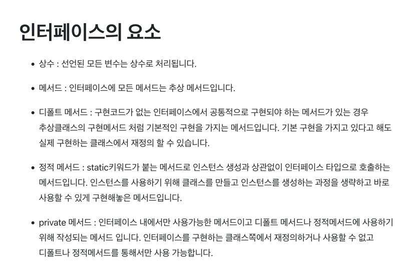

# 추상 클래스보다는 인터페이스를 우선하라

- 요약
    - 자바의 다중 구현 메커니즘에는 추상클래스와 인터페이스가 있다.
    - 인터페이스는 `mixin` 정의에 안성맞춤이다. 대상 타입의 주된 기능에 선택적 기능을 혼합한다고 해서 mixin이라고 부른다. mixin은 mixin을 구현하는 클래스에 원래의 주된 타입외에도 특정 선택적 행위를 제공한다고 선언하는 효과를 준다.
    - 인터페이스의 default 메서드로 구현을 제공해 프로그래머들의 일감을 덜어줄 수 있다. 이때는 상속하려는 사람을 위해 @implSpec 자바독 태그를 붙여 문서화해야한다.
    - 인터페이스 제약
      - equals나 hashCode 같은 Object 메서드를 default 메서드로 제공하면 안된다.
      - 인스턴스 필드를 가질 수 없고, public이 아닌 정적 멤버도 가질 수 없다.(private 정적 메서드는 예외)
      - 본인이 만들지 않은 인터페이스에는 default 메서드를 추가할 수 없다.
    - 
    - 인터페이스와 추상 골격 구현 클래스를 함께 제공하는 식으로 인터페이스와 추상 클래스의 장점을 모두 취하는 방법도 있다.
      - 인터페이스로는 타입을 정의하고, 골격 구현 클래스로 추상 클래스처럼 구현을 도와주는 동시에 추상클래스로 타입을 정의할 때 따라오는 심각한 제약에서는 자유롭다.
      - ex) List로 반환형 타입을 정의하고, AbstractList의 몇가지만 override하여 리턴
    - 골격 구현 작성]
      1. 인터페이스에서 다른 메서드들의 구현에 기반이 되는 메서드를 선정하여, 골격 구현에서 추상 메서드로 만든다.
      2. 기반 메서드들을 사용해 직접 구현할 수 있는 메서드들을 모두 default 메서드로 제공한다.
         - 모든 메서드 = 기반 메서드 + default 메서드라면 따로 골격 구현 클래스를 만들 필요는 없다.
         - 남은 메서드가 있다면, 이 인터페이스를 구현하는 골격 구현 클래스를 하나 만들어 남은 메서드들을 작성해 넣는다.
- 질문
    - 템플릿 메서드 패턴, 어댑터